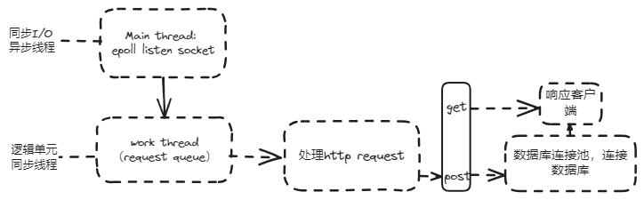

# CPP实现简单的WebServer

## 框架



## 项目结构

- `root`: 静态资源
- `config.yaml`: 配置文件
- `main.cpp`: 主程序
- `src`: 源码（主要模块）
    - `webserver`: 创建服务器，开启监听
    - `http_conn`: 解析http请求
    - `threadpool`: http请求线程池,启动多线程处理http请求
    - `sql_connection_pool`: 数据库连接池,创建多个数据库连接

## 项目运行

```shell
mkdir build
cd build && cmake ..
make && cd ..
./bin/main
```